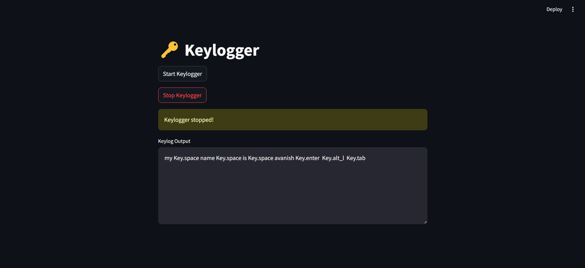

# 🔑 Keylogger Streamlit App

A simple keylogger built with Python and Streamlit that records keystrokes and saves them in a `.txt` file. The keylogger logs alphanumeric keys, spaces, and special keys while ensuring that previous logs are cleared upon restart.

## 🚀 Features
- Logs all keyboard inputs (alphabets, numbers, special keys)
- Saves keystrokes in `keylog.txt` file
- Clears previous logs when restarted
- Minimal dependencies for easy deployment
- Simple Streamlit UI for starting and stopping the keylogger

## 📂 Project Structure
```
📁 Keylogger
 ├── Keylogger.py         # Main application script
 ├── requirements.txt     # Dependencies list
 ├── keylog.txt           # Log file (auto-generated)
 ├── README.md            # Project documentation
```

## 🛠 Installation
### 1️⃣ Clone the Repository
```sh
git clone https://github.com/yourusername/Keylogger.git
cd Keylogger
```

### 2️⃣ Create a Virtual Environment (Optional but Recommended)
```sh
python -m venv venv
source venv/bin/activate  # macOS/Linux
venv\Scripts\activate     # Windows
```

### 3️⃣ Install Dependencies
```sh
pip install -r requirements.txt
```

### 4️⃣ Run the Application
```sh
streamlit run Keylogger.py
```

## 📌 Usage
1. Click the **Start Keylogger** button to begin logging keystrokes.
2. Click **Stop Keylogger** to stop recording keystrokes.
3. The keystrokes will be saved in `keylog.txt`.

## 🚀 Deployment on Streamlit Cloud
To deploy on Streamlit Cloud, follow these steps:
1. Create a `requirements.txt` file with the dependencies:
   ```txt
   streamlit
   pynput
   ```
2. Push the project to GitHub.
3. Go to [Streamlit Cloud](https://share.streamlit.io/) and deploy your repository.

## 🖼️ Screenshots
### 🎯 **Home Screen**



## ⚠️ Disclaimer
This project is intended for educational purposes only. **Do not use it for malicious activities.** Unauthorized use of keyloggers is illegal.

## 📜 License
This project is licensed under the MIT License.

## ✨ Author
Developed by **Avanish Yadav** 🚀
